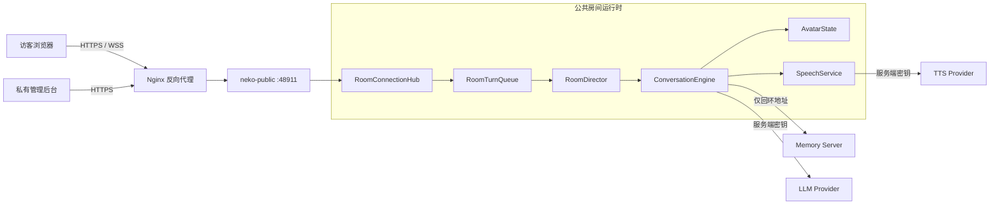

<div align="center">

# NEKO-ONE

### 它记得你，也记得这个房间。

拥有 Live2D 身体、连续人格和分层长期记忆的公共房间主持者。


[快速开始](#快速开始) · [它有什么不同](#它有什么不同) · [架构](#架构) · [部署](#部署到公网) · [设计文档](docs/design/public-room-web-architecture.md)

</div>

---

NEKO-ONE 不是把大模型塞进聊天框，也不是每次刷新后重新认识你的虚拟角色。

它是一个长期在线的公共房间实体：看得见访客、知道该回复谁、能控制房间节奏，并把对话沿着 **Recent → Facts → Reflections → Persona** 的证据链沉淀下来。文字、表情和声音由服务器统一生成，因此所有人看到的是同一个 NEKO，而不是各自浏览器里的十个副本。

> **一句话定位：** 一个拥有身体、连续记忆，能辨认不同访客并主持公共房间的长期在线实体。

## 它有什么不同

| 能力 | NEKO-ONE 的做法 |
| --- | --- |
| **统一人格** | Persona 与反思长期存在，不随网页刷新消失 |
| **有证据的记忆** | 保留原始时间记录、事实去重、反思归档与混合召回 |
| **认识不同访客** | 房间共享记忆与访客独立记忆严格分域，避免串话 |
| **会主持房间** | 唯一的服务器端 `RoomDirector` 选择回复对象、控制频率并避免刷屏 |
| **有身体和声音** | Live2D 表情跟随流式回复，一份 TTS 音频广播给全房间 |
| **为公网而收敛** | 浏览器只获得公开消息与渲染资源，模型密钥、Persona 和原始记忆始终留在服务端 |

### 房间里的体验

- 多访客实时聊天、在线人数和回复队列状态；
- LLM 流式文字、情绪标签与 Live2D 动作同步；
- 同一条回复只合成一次语音，并共享给所有在线访客；
- WebSocket 自动重连，按房间序号续传错过的事件；
- `request_id` 幂等发送，网络抖动不会重复写入消息；
- 管理员可审核记忆、保护 Persona、隐藏消息、封禁访客和调整限额。

## 架构



第一版采用单实例、单主写入者和 SQLite。这个约束让消息顺序、模型输出、记忆写入和 TTS 广播保持确定；需要水平扩容时，再引入 Redis、PostgreSQL 与对象存储。

## 快速开始

### 1. 准备环境

需要：

- Python **3.11**；
- [uv](https://docs.astral.sh/uv/)；
- 已配置的私有 LLM 参数；
- 可选的 TTS 参数。

```powershell
git clone https://github.com/Himifox/NEKO-ONE.git
Set-Location NEKO-ONE
uv sync --locked
Copy-Item .env.public.example .env.public
```

编辑 `.env.public`，至少替换以下值：

```dotenv
NEKO_PUBLIC_ALLOWED_ORIGINS=http://127.0.0.1:48911
NEKO_PUBLIC_SESSION_SECRET=replace-with-at-least-48-random-characters
NEKO_PUBLIC_ADMIN_PASSWORD=replace-with-a-long-unique-admin-password
```

真实 LLM/TTS 密钥继续保存在 NEKO 的私有服务端配置目录中，**不要**写入 `.env.public.example`、前端文件或 Git。

### 2. 启动两个服务

终端一——启动私有记忆服务：

```powershell
uv run --env-file .env.public neko-memory
```

终端二——启动公共房间：

```powershell
uv run --env-file .env.public neko-public
```

打开：

- 公共房间：<http://127.0.0.1:48911/>
- 管理后台：<http://127.0.0.1:48911/admin>
- 存活检查：<http://127.0.0.1:48911/api/v1/health/live>
- 就绪检查：<http://127.0.0.1:48911/api/v1/health/ready>

如果 `NEKO_PUBLIC_ADMIN_PASSWORD` 少于 12 位或未设置，管理 API 会保持禁用。

## 记忆与身份边界

NEKO-ONE 把记忆拆成三层，而不是把所有访客的话混进一个向量库：

```text
管理员保护的 Persona
        ↑ 仅管理员可以修改
房间共享记忆
        ↑ 仅审核后的事实可以写入
访客独立记忆
        ↑ 只记录该访客与 NEKO 的交互
```

- 普通访客不能修改 Persona；
- 单个访客的陈述不会自动升级为房间共享事实；
- 当前回复只召回房间记忆与目标访客自己的记忆；
- 管理员可以审核公共事实，也可以彻底遗忘指定访客；
- 浏览器不会收到原始记忆文件、内部主体 ID 或 Memory Server 地址。

完整机制见 [长期记忆架构](docs/architecture/memory-system.md)。

## 管理后台

`/admin` 是服务器管理入口，不是公开的模型配置页面。当前支持：

- 查看房间、访客、消息和审计状态；
- 编辑受保护的角色 Persona；
- 添加审核后的房间共享事实；
- 删除指定访客的独立记忆；
- 封禁或恢复访客；
- 隐藏或恢复公共消息；
- 调整消息长度、频率和窗口限额。

登录使用签名的 `HttpOnly` Cookie，并对修改操作执行 CSRF 校验。生产环境必须启用 HTTPS 和安全 Cookie。

## 部署到公网

推荐拓扑是一台 VPS 上的两个回环服务加一个公开反向代理：

| 网络入口 | 作用 | 是否公开 |
| --- | --- | --- |
| `443/tcp` | Nginx HTTPS / WSS | **是** |
| `127.0.0.1:48911` | 公共房间 API | 否 |
| Memory Server 端口 | 长期记忆服务 | 否 |
| LLM / TTS 配置 | 供应商凭据 | 否 |

仓库提供了 Nginx 配置、两个 systemd unit 和环境变量模板。参见 [部署说明](deploy/README.md)。上线前请替换域名与所有密钥，并为公共数据库、记忆与私有配置建立每日备份和恢复演练。

## 验证

所有 Python 验证均通过 `uv` 运行：

```powershell
uv run --locked python scripts/verify_public_room.py
uv run --locked python scripts/check_public_boundary.py
node --check frontend/public-room/app.js
node --check frontend/public-room/live2d.js
node --check frontend/public-admin/app.js
```

`verify_public_room.py` 使用假的模型、记忆和 TTS 实现，不会调用真实供应商或污染正式记忆。它覆盖多人连接、消息序号、幂等发送、断线续传、管理审核、封禁与限额。

## 仓库边界

### 保留

文本 LLM、多供应商适配、流式输出、Live2D、情绪标签、TTS、分层记忆、Persona、公共房间协议和私有管理后台。

### 明确不包含

Agent Server、插件市场、浏览器/电脑控制、Steam、云存档、游戏、Galgame、ASR、实时语音输入、VRM、MMD、PNGTuber、桌面启动器及直播平台礼物逻辑。

## 当前版本

`v0.1` 是可部署的单房间基线，设计目标为 **10–50 人的小型公共房间**。当前使用游客身份、单实例和 SQLite；账号体系、多实例协调、直播平台接入以及公开声音配置不在第一版范围内。

## 项目结构

```text
app/public_room_server/   公共 FastAPI 入口
app/memory_server/        私有长期记忆服务
main_logic/room/          连接、队列、导演、对话、记忆与语音编排
main_routers/             公共 HTTP、管理 API 与 WebSocket 协议
frontend/public-room/     访客页面
frontend/public-admin/    私有管理后台
deploy/                   Nginx 与 systemd 部署配置
docs/                     当前架构与设计文档
```

## License

本项目采用 [Apache License 2.0](LICENSE)。第三方资源的授权信息见 [NOTICE](NOTICE)。
